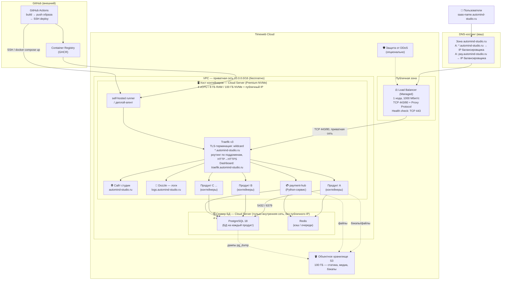

# Deploy Diagram — инфраструктура Automind Studio (Timeweb Cloud)

**Профиль:** single-node (без HA), малый масштаб 3–7 продуктов, Managed Load Balancer от Timeweb в режиме **TCP + Proxy Protocol**, TLS-терминация — на **Traefik**.
**Домен:** `automind-studio.ru`, продукты на поддоменах `*.automind-studio.ru`, свой DNS-хостинг, купленный wildcard-сертификат.
**Регион в расчётах:** Санкт-Петербург / Москва. Дата: июнь 2026.

---

## 1. Deploy Diagram

---

## 2. Состав ресурсов и цены

Расчёт по конфигуратору **Premium NVMe** (СПб/МСК, цены с 15.12.2025, без IPv4 где доступ только внутренний):
1 vCPU = 210 ₽, 1 ГБ RAM = 200 ₽, 1 ГБ NVMe = 12 ₽, публичный IP = 180 ₽/мес.

| # | Ресурс | Роль | Конфигурация | Цена, ₽/мес |
|---|--------|------|--------------|-------------|
| 1 | **Load Balancer (Managed)** | Точка входа: TCP-балансировка 443/80, Proxy Protocol, health-checks | 1 нода, 1000 Мбит/с | **225** |
| 2 | **Cloud Server — хост контейнеров** | Docker Compose: reverse-proxy + продукты + payment-hub + runner | 4 vCPU / 8 ГБ / 100 ГБ NVMe + публ. IP | **3 820** |
| 3 | **Cloud Server — сервер БД** | PostgreSQL 18 + Redis, только внутренняя сеть | 4 vCPU / 8 ГБ / 120 ГБ NVMe, без IP | **3 880** |
| 4 | **S3 Bucket** | Статика, медиа, бэкапы | 100 ГБ (вкл. 100 ГБ трафика) | **159** |
| 5 | **VPC (приватная сеть)** | Изоляция БД, внутренний трафик | 10.0.0.0/16 | **0** |
| | | | **Итого (база)** | **≈ 8 084** |
| 6 | Защита от DDoS *(опц.)* | Защита точки входа | на LB / сервер | +550 |
| | | | **Итого с DDoS** | **≈ 8 634** |

Детализация серверов:
- **Хост контейнеров:** 4×210 + 8×200 + 100×12 + 180 (IP) = 840 + 1600 + 1200 + 180 = **3 820 ₽**
- **Сервер БД:** 4×210 + 8×200 + 120×12 = 840 + 1600 + 1440 = **3 880 ₽**

> Цены — ориентир. Точную сумму удобно проверить в калькуляторе: https://timeweb.cloud/prices

---

## 3. Варианты бюджета

| Вариант | Хост контейнеров | Сервер БД | LB | S3 | Итого ≈ ₽/мес |
|---------|------------------|-----------|----|----|---------------|
| **Lean MVP** | 2 vCPU / 4 ГБ / 50 ГБ +IP (2 000) | 2 vCPU / 4 ГБ / 60 ГБ (1 940) | 1 нода 500 Мбит/с (135) | 10 ГБ (79) | **≈ 4 154** |
| **Рекомендуемый** | 4 vCPU / 8 ГБ / 100 ГБ +IP (3 820) | 4 vCPU / 8 ГБ / 120 ГБ (3 880) | 1 нода 1000 Мбит/с (225) | 100 ГБ (159) | **≈ 8 084** |
| **С запасом / pre-HA** | 6 vCPU / 12 ГБ / 150 ГБ +IP (5 640) | 6 vCPU / 16 ГБ / 200 ГБ (6 860) | 2 ноды 1000 Мбит/с (675) | 250 ГБ (399) | **≈ 13 574** |

Альтернатива по БД — **Managed DBaaS** (бэкапы и обслуживание на стороне Timeweb): PostgreSQL `Cloud DB 4/8/80` = 3 160 ₽/мес, Redis `Cloud DB 1/2/20` = 790 ₽/мес. Минус — версия PostgreSQL ограничена тем, что предлагает провайдер (PG 18 может быть недоступен), поэтому для жёсткого требования «PostgreSQL 18» предпочтителен self-managed на отдельном сервере.

---

## 4. Маршрут трафика и поддомены

1. В DNS-зоне `automind-studio.ru` заводится wildcard-запись `A *.automind-studio.ru` → публичный IP балансировщика (плюс A-записи апекса и `www`). Новый продукт = просто новый контейнер + traefik-лейбл, отдельная DNS-запись не нужна.
2. Load Balancer работает в **TCP-режиме**: пробрасывает 443 и 80 на хост по приватной сети с Proxy Protocol (Traefik видит реальные IP клиентов).
3. **Traefik** на хосте терминирует TLS wildcard-сертификатом, редиректит HTTP→HTTPS и маршрутизирует по `Host`: `automind-studio.ru` → сайт студии, `saas-a.automind-studio.ru` → продукт A, `pay.automind-studio.ru` → payment-hub, `traefik.`/`logs.` → dashboard/Dozzle (за basic auth).
4. Приложения ходят в PostgreSQL (5432) и Redis (6379) **только по приватной сети** — порты БД привязаны к приватному IP.

> TLS-терминация на LB не используется сознательно: загрузка своего сертификата в LB Timeweb зависала на «проверке А-записи» (июнь 2026), а TCP-режим от неё не зависит и дополнительно даёт корректный `X-Forwarded-Proto` от Traefik. Подробности и cloud-init — в `ams-cloud-init.md`.

---

## 5. CI/CD (GitHub Actions → автодеплой)

- На push в `main`: workflow собирает Docker-образ, пушит в **GHCR** (GitHub Container Registry).
- Деплой одним из способов: **self-hosted runner** на хосте контейнеров, либо SSH-экшен (`appleboy/ssh-action`) → `docker compose pull && docker compose up -d`.
- Секреты (DB-пароли, ключи S3, токены payment-hub) — в **GitHub Actions Secrets**, на сервере в `.env`/`docker secrets`.
- Откат — через теги образов и `docker compose` на предыдущую версию.

---

## 6. «Предусмотри что-то ещё» — рекомендации

| Область | Что добавить | Зачем |
|---------|--------------|-------|
| **Бэкапы** | `pg_dump` по cron в S3 (или авто-бэкапы DBaaS); версионирование бакета | Восстановление БД и файлов |
| **Мониторинг** | Prometheus + Grafana (контейнеры) или встроенный мониторинг Timeweb; алерты в Telegram | Видеть нагрузку CPU/RAM/диск, падения |
| **Логи** | Loki + Promtail / Grafana | Централизованные логи всех продуктов |
| **Ошибки приложений** | Sentry (self-hosted или облако) | Трекинг ошибок в продуктах и payment-hub |
| **Безопасность сети** | Firewall: наружу открыты только 80/443 на LB; SSH по ключу + бастион/jump-host; БД — только VPC | Минимизация поверхности атаки |
| **Секреты** | Doppler / Vault / SOPS вместо «голых» `.env` | Управление и ротация секретов |
| **Registry** | GHCR или приватный Registry на хосте | Хранение и версионирование образов |
| **Staging** | Отдельный дешёвый сервер или префикс `*.stage.automind-studio.ru` | Тесты до прода |
| **payment-hub** | Вынести в отдельный сетевой сегмент / отдельный сервер при росте | Изоляция платёжного контура (комплаенс) |
| **DDoS** | Защита от DDoS на точке входа | Доступность при атаках |
| **IaC** | Terraform-провайдер Timeweb + хранение конфигов в Git | Воспроизводимость инфраструктуры |

---

## 7. Путь к отказоустойчивости (когда вырастете)

1. **LB → 2 ноды** (active-backup, 675 ₽/мес) — убираем единую точку отказа на входе.
2. **2-й хост контейнеров** в том же VPC, оба за балансировщиком — горизонтальное масштабирование и zero-downtime деплой.
3. **PostgreSQL master + standby-реплика** (streaming replication) + Redis Sentinel.
4. Состояние приложений — stateless, всё в БД/Redis/S3, чтобы хосты были взаимозаменяемы.

---

### Источники цен
- Облачные серверы / конфигуратор и прайс с 15.12.2025: https://st.timeweb.com/cloud-static/timeweb-cloud-pricing-15-12-2025.pdf
- Балансировщик нагрузки (135 / 225 / 675 ₽): https://timeweb.cloud/services/load-balancer
- Облачные БД (DBaaS): https://timeweb.cloud/services/postgresql
- S3-хранилище (79 / 159 / 399 / 3999 ₽): https://timeweb.cloud/services/s3-storage
- VPC (бесплатно): https://timeweb.cloud/services/vpc
- Калькулятор: https://timeweb.cloud/prices
